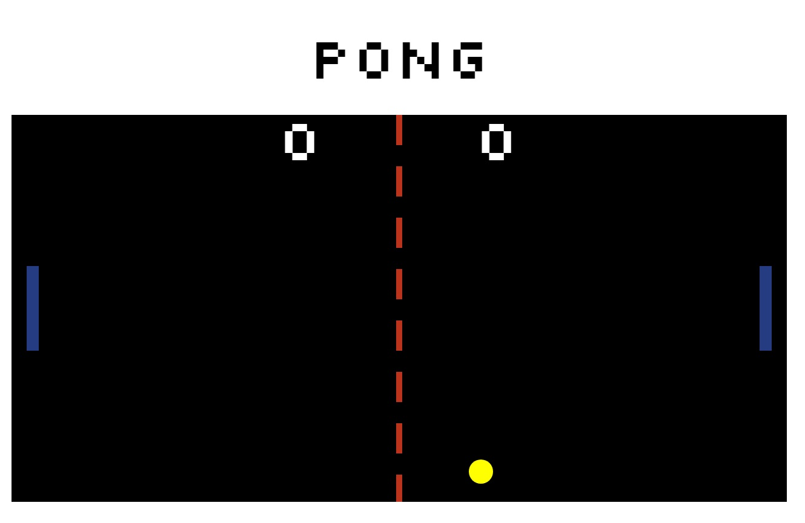

# Pong Game

We Built this pong game as a class "code along". For this project we built the board out of SVGs and compiled ES6 code into ES5 using Babel. We were then encouraged to use what we learned about SVGs and javascript to implement things to customise our games and make them our own. While we were only required to come up with one modification, I really enjoyed working on this and felt compelled to keep adding features. 

## My additions to the game

* The ball speed increments up by 5% on every paddle collision.
* The "press space to start" on load.
* Victory announcement when a player reaches 15 points.
* Once a player has a 5 point lead on the other, the player who is losing doubles paddle length
* On a rally of 12 or more, the ball splits into 2.

## Setup

**Install dependencies:**

`> npm i`

**Run locally with Webpack Dev Server:**

`> npm start`

**Build for production:**

`> npm run build`

## Keys

* spacebar: start game / pause

**Player 1:**
* a: up
* z: down

**Player 2:**
* ▲ : up
* ▼: down
